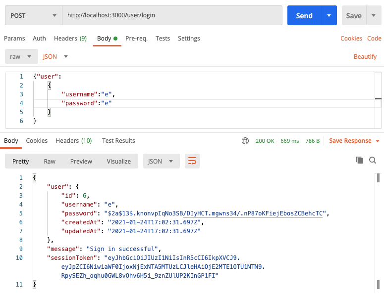

Registering a new user:

Existing user logs in:

User enters a workout log:

User sees all of their workout logs:

User sees one of their workout logs:

User tries to see one of someone else's workout logs:

User updates one of their workout logs:

User tries to update someone else's workout logs:

User deletes one of their workout logs:

User tries to delete someone else's workout logs:
